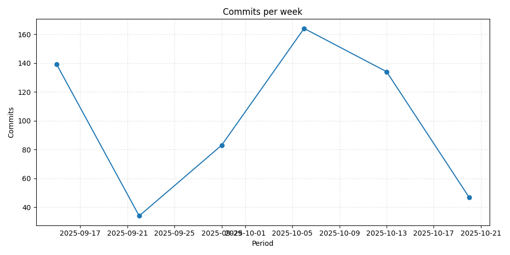

# Repository metrics for `dsainz3/gate-hub`

_Generated 2025-10-17T06:17:51.340491+00:00Z_

## Highlights

| Metric | Daily | Weekly | Monthly |
| --- | ---: | ---: | ---: |
| Commits | 1 (-50.0%) | 165 (+24.1%) | 470 (+2138.1%) |

## Charts

## Pull request quality

* Median time to merge: `0.00` days
* Average files changed per PR: `0.0`
* Lines added vs deleted: `+728,960` / `-452,007`