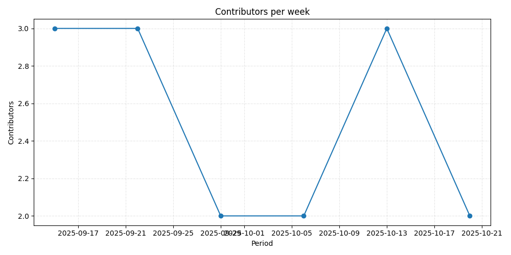
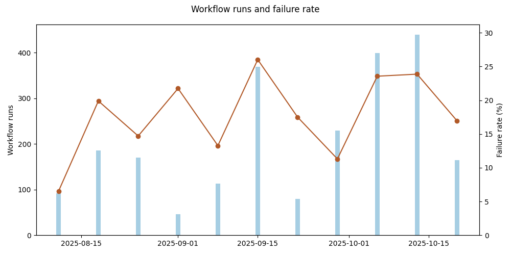

# Repository metrics for `dsainz3/gate-hub`

_Generated 2025-10-25T06:16:51.747928+00:00Z_

## Highlights

| Metric | Daily | Weekly | Monthly |
| --- | ---: | ---: | ---: |
| Commits | 1 (-85.7%) | 57 (-61.5%) | 462 (+232.4%) |

## Charts

## Pull request quality

* Median time to merge: `0.00` days
* Average files changed per PR: `0.0`
* Lines added vs deleted: `+781,719` / `-461,115`
