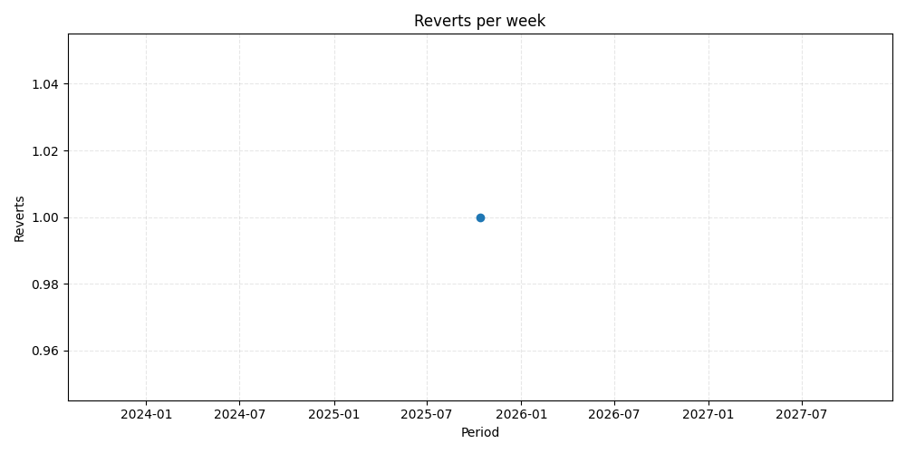

# Repository metrics for `dsainz3/gate-hub`

_Generated 2025-10-19T06:17:40.983452+00:00Z_

## Highlights

| Metric | Daily | Weekly | Monthly |
| --- | ---: | ---: | ---: |
| Commits | 1 (-97.2%) | 131 (-18.1%) | 489 (+858.8%) |

## Charts

## Pull request quality

* Median time to merge: `0.00` days
* Average files changed per PR: `0.0`
* Lines added vs deleted: `+739,213` / `-457,999`